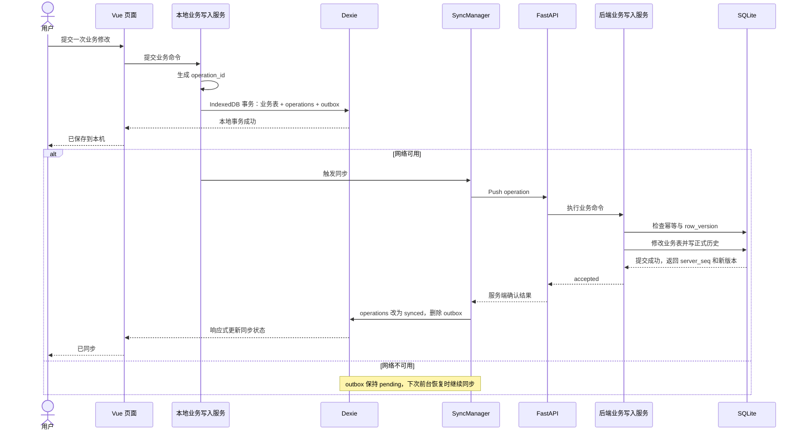
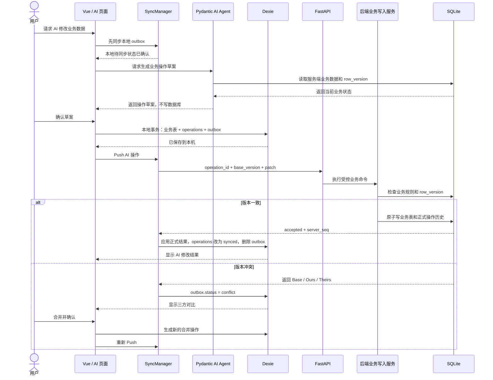

# Casual-bookkeeping 前后端数据结构

> 本文是开发时的数据结构参考，只收录已定内容；未定内容登记在 `AGENTS.md` 的“未定事项”中。

## 1. 文档目的与使用范围

- 统一业务数据、同步、操作历史、冲突与撤回的前后端结构，供 Vue/Dexie、FastAPI/SQLite 和 AI 工具开发使用。
- AI 对话（会话与回合）存储已拆出，见 `docs/ai-chat-storage.md`。
- 前后端存储形式可以不同，但业务字段语义和校验规则一致。
- 本文只收录已定内容，未定内容见 `AGENTS.md` 的“未定事项”。
- 若本文与用户后续明确要求冲突，以用户要求为准，并同步更新相关文档。

## 2. 核心原则

1. **一行工单一种服务**：一张工单只能选择一个服务大类和一个服务小类。
2. **先选项后录入**：服务大类、小类由服务选项表维护；录入时不能直接填写未维护的小类，必须先新增选项再选择。
3. **文本快照**：工单保存客户编号、客户名称、服务大类、服务小类和单位的文本快照；以后修改配置不会改写历史工单。
4. **客户身份稳定**：同一个真实厂家长期使用同一个 `customer_id`；编号、人名或缩写改变时，只新增或调整编号映射。
5. **本地优先**：页面先读写 Dexie，后端 SQLite 保存跨设备共享的权威状态。
6. **统一前端入口**：Vue 页面只通过 Repository / 业务写入服务（MutationService）读写 Dexie，不直接根据在线状态切换数据源。
7. **先本地后同步**：在线和离线都先提交本地事务；在线时随后立即同步后端。
8. **一次动作对应一次操作**：一次表单提交、批量修改或 AI 修改对应一个 `operation_id`。
9. **服务端最终确认**：本地保存可离线工作的业务副本，后端接受后才算“已同步”。
10. **不静默覆盖**：通过 `row_version` 检测并发修改，不采用最后写入覆盖。
11. **历史只追加**：撤回通过一条新的反向操作完成，不删除原操作。
12. **原子提交**：后端业务表、操作主表和操作明细在同一个 SQLite 事务中提交。
13. **应用层校验**：数据库不声明业务表之间的外键约束，由应用层完成存在性、有效期和大小类匹配校验。
14. **金额精确到分**：以整数存储，不使用浮点数。

### 已确定边界

本阶段明确不采用：

- 在线和离线两套独立写入路径。
- 最后写入覆盖。
- AI 直接执行 SQL。
- AI 运行期间锁定本地数据库，或单独维护持久化运行状态表。
- 点对点复制或 CRDT。
- 完整事件溯源和数据库版本树。
- 任意时间点整库恢复。
- 依赖 iOS PWA 后台长期运行保证同步。
- 在业务操作 Pull 中传输图片、录音等大文件。

## 3. 数据角色

| 角色 | 存放位置 | 职责 |
| --- | --- | --- |
| 业务状态 | 前端四张业务表（Dexie）/ 后端四张业务表（SQLite） | 当前业务数据 |
| 待同步命令 | 前端 `outbox` | 尚未得到服务端确认的写入请求 |
| 正式操作历史 | 后端 `database_operations` + `operation_changes` | 幂等、同步顺序、来源追踪、撤回依据 |
| 本地历史镜像 | 前端 `operations` | 近期历史展示与撤回入口；不参与业务写入 |
| 同步元数据 | 前端 `sync_state` | 账户、设备、已应用服务端序号、最近同步时间 |
| 临时冲突材料 | 前端 `outbox.conflict_json` | Base / Ours / Theirs 三方对比，不进入后端正式历史 |

## 4. 业务数据模型

### 4.1 前后端对照

| 后端 SQLite 表 | 前端 Dexie 表 | 用途 |
| --- | --- | --- |
| `work_orders` | `workOrders` | 工单录入、查询和离线修改 |
| `customers` | `customers` | 客户主数据 |
| `customer_code_mappings` | `customerCodeMappings` | 按业务日期选择客户编号映射 |
| `service_categories` | `serviceCategories` | 服务大类、小类和默认单位 |

每条可同步业务记录使用前后端共用的 `sync_id` 定位同一条数据。后端另有内部整数主键，不进入同步协议；前端 Dexie 业务表以 `sync_id` 为主键。

四张业务表均带账户隔离列 `account_phone`（值存账户手机号）：所有账户共用同一套表结构，写入时强制带 `account_phone`，查询时强制按当前账户过滤，账户之间数据互不可见。详见 `docs/auth-structure.md`。

前端 Dexie 对应业务记录保存服务端确认的 `row_version`，用于生成提交时的 `base_version`。

业务存储有意不追求完整规范化：工单保存录入时的文本与数字，日常展示和统计不依赖联表查询。服务名称改名后，新旧文本会被统计为不同项目；因此所有正常工单必须从维护好的选项中选择，不允许直接绕过配置自由输入。

下文各业务表字段是业务语义字段。最终实现中，后端四张业务表还保存 `sync_id`（唯一）与 `row_version`；前端 Dexie 记录使用 camelCase 字段名（如 `syncId`、`rowVersion`），完整命名映射登记在 `AGENTS.md` 的“未定事项”。

### 4.2 服务选项表 `service_categories`

**一行含义：一个服务大类，以及它包含的全部小类配置。**

| 列名 | SQLite 类型 | 约束/含义 |
| --- | --- | --- |
| `service_category_id` | INTEGER | 内部主键，自增 |
| `account_phone` | TEXT | 所属账户（手机号），账户间数据隔离 |
| `category_name` | TEXT | 大类名称，例如“洗水”“刷毛”“车缝扣子”；同账户内不可重复 |
| `subcategories_json` | TEXT | 小类 JSON 数组，由应用校验格式 |
| `is_active` | INTEGER | 大类是否可用于新工单：`0/1` |
| `created_at` | TEXT | 创建时间，ISO 8601 |
| `updated_at` | TEXT | 最后修改时间，ISO 8601 |

小类 JSON 结构：

```json
[
  {
    "name": "单洗",
    "default_unit": "件",
    "is_active": true
  },
  {
    "name": "洗烘一体",
    "default_unit": "件",
    "is_active": true
  },
  {
    "name": "烘件染",
    "default_unit": "件",
    "is_active": false
  }
]
```

当前大类及小类示例：

- 洗水：单洗、洗烘一体、烘件染
- 刷毛：背心、圆领、开胸、开胸带扣
- 车缝扣子：由使用者维护具体小类

规则：

- 创建工单时，小类的 `default_unit` 自动带入工单，允许使用者修改。
- 停用大类或小类只会让它不再出现在新工单选项中，不影响历史工单。

建表语句：

```sql
CREATE TABLE service_categories (
    service_category_id INTEGER PRIMARY KEY AUTOINCREMENT,
    account_phone TEXT NOT NULL,
    category_name TEXT NOT NULL,
    subcategories_json TEXT NOT NULL,
    is_active INTEGER NOT NULL DEFAULT 1 CHECK (is_active IN (0, 1)),
    created_at TEXT NOT NULL,
    updated_at TEXT NOT NULL,
    UNIQUE (account_phone, category_name)
);
```

> 列 `account_phone`：所属账户（手机号），账户间数据隔离。`category_name` 的不可重复仅在**同一账户内**成立，故唯一约束改为 `(account_phone, category_name)` 复合唯一。

### 4.3 真实客户表 `customers`

**一行含义：一个长期稳定的真实厂家/客户对象。**

更换编号、联系人、人名或缩写时，仍使用同一个 `customer_id`。

| 列名 | SQLite 类型 | 约束/含义 |
| --- | --- | --- |
| `customer_id` | INTEGER | 内部主键，自增，长期稳定 |
| `account_phone` | TEXT | 所属账户（手机号），账户间数据隔离 |
| `canonical_name` | TEXT | 厂家的内部正式名称或稳定称呼 |
| `created_at` | TEXT | 创建时间 |
| `updated_at` | TEXT | 最后修改时间 |
| `archived_at` | TEXT | 可空；不再使用时归档，不直接删除 |

```sql
CREATE TABLE customers (
    customer_id INTEGER PRIMARY KEY AUTOINCREMENT,
    account_phone TEXT NOT NULL,
    canonical_name TEXT NOT NULL,
    created_at TEXT NOT NULL,
    updated_at TEXT NOT NULL,
    archived_at TEXT
);
```

### 4.4 客户编号映射表 `customer_code_mappings`

**一行含义：某个客户编号在一个明确时期内对应的真实客户和显示人名。**

| 列名 | SQLite 类型 | 约束/含义 |
| --- | --- | --- |
| `mapping_id` | INTEGER | 内部主键，自增 |
| `account_phone` | TEXT | 所属账户（手机号），账户间数据隔离 |
| `customer_id` | INTEGER | 对应真实客户 ID；作为普通整数保存，不声明外键 |
| `customer_code` | TEXT | 客户编号；必须使用文本，以保留 `001` 等前导零 |
| `customer_name` | TEXT | 显示名称，可填完整人名或缩写 |
| `valid_from` | TEXT | 开始有效日期，`YYYY-MM-DD` |
| `valid_to` | TEXT | 结束有效日期，可空；空表示目前仍然有效 |
| `created_at` | TEXT | 映射记录创建时间 |
| `updated_at` | TEXT | 最后修改时间 |

```sql
CREATE TABLE customer_code_mappings (
    mapping_id INTEGER PRIMARY KEY AUTOINCREMENT,
    account_phone TEXT NOT NULL,
    customer_id INTEGER NOT NULL,
    customer_code TEXT NOT NULL,
    customer_name TEXT NOT NULL,
    valid_from TEXT NOT NULL,
    valid_to TEXT,
    created_at TEXT NOT NULL,
    updated_at TEXT NOT NULL,
    CHECK (valid_to IS NULL OR valid_to >= valid_from)
);
```

映射规则：

1. 根据工单的 `work_order_date` 判断映射是否有效，而不是根据系统创建时间判断。
2. 同一个 `customer_code` 的不同有效期不允许重叠，由应用在保存映射时校验。
3. 可以连续分配，例如 `001` 在上半年属于客户 A、下半年属于客户 B。
4. 编号映射改变后，旧工单仍保留录入时的编号和名称文本。

### 4.5 工单主表 `work_orders`

**一行含义：一次完整的工单记录。**

| 列名 | SQLite 类型 | 约束/含义 |
| --- | --- | --- |
| `work_order_id` | INTEGER | 内部主键，自增 |
| `account_phone` | TEXT | 所属账户（手机号），账户间数据隔离 |
| `work_order_date` | TEXT | 业务日期，`YYYY-MM-DD`，允许使用者修改 |
| `created_at` | TEXT | 系统实际创建时间，不供普通编辑 |
| `updated_at` | TEXT | 最后修改时间 |
| `deleted_at` | TEXT | 可空；软删除时间 |
| `customer_id` | INTEGER | 稳定的真实客户 ID，不声明外键 |
| `customer_code` | TEXT | 创建工单时的客户编号快照 |
| `customer_name` | TEXT | 创建工单时的名称快照，可填写完整人名或缩写 |
| `service_category` | TEXT | 创建工单时选中的服务大类文本 |
| `service_item` | TEXT | 创建工单时选中的服务小类文本 |
| `quantity` | INTEGER | 正整数数量 |
| `unit` | TEXT | 单位文本，例如“件”“套” |
| `unit_price_cents` | INTEGER | 可空；以分为单位的单价，`NULL` 表示尚未定价 |
| `is_completed` | INTEGER | 是否完成：`0/1`，只作为标记，不限制编辑 |

```sql
CREATE TABLE work_orders (
    work_order_id INTEGER PRIMARY KEY AUTOINCREMENT,
    account_phone TEXT NOT NULL,
    work_order_date TEXT NOT NULL,
    created_at TEXT NOT NULL,
    updated_at TEXT NOT NULL,
    deleted_at TEXT,

    customer_id INTEGER NOT NULL,
    customer_code TEXT NOT NULL,
    customer_name TEXT NOT NULL,

    service_category TEXT NOT NULL,
    service_item TEXT NOT NULL,
    quantity INTEGER NOT NULL CHECK (quantity > 0),
    unit TEXT NOT NULL CHECK (trim(unit) <> ''),

    unit_price_cents INTEGER
        CHECK (unit_price_cents IS NULL OR unit_price_cents >= 0),
    is_completed INTEGER NOT NULL DEFAULT 0
        CHECK (is_completed IN (0, 1))
);
```

工单行为规则：

1. 新建工单时，`unit_price_cents` 默认为 `NULL`，不自动带入价格。
2. `NULL` 表示尚未定价，`0` 表示单价确实为零，两者含义不同。
3. 使用者后期通过日期、客户、服务类型等条件筛选工单，再批量或逐条填写单价。
4. 总价不单独入库，统计时计算 `quantity * unit_price_cents`。
5. `is_completed` 仅作标记；无论是否完成，所有字段都允许修改。
6. 内容完全相同的工单可以同时存在，以不同的 `work_order_id` 区分。

### 4.6 录入与校验流程

1. 使用者先选择或填写 `work_order_date`，也可以使用规则自动填入。
2. 应用按照该日期加载有效的客户编号映射。
3. 选择客户后，将 `customer_id`、`customer_code` 和 `customer_name` 写入工单。
4. 应用从启用的服务大类中加载小类 JSON。
5. 选择小类后自动带入默认单位，使用者可以修改单位。
6. 应用校验小类确实属于所选大类，然后将大类、小类和单位文本写入工单。
7. 数量必须是大于零的整数。
8. 新工单单价保持为空，后期再统一处理。

大小类匹配和客户有效期校验放在应用层。服务选项数量很少，可以在启动或进入录入页面时加载到内存中。

当前不实现价格规则表和自动价格匹配。它们可以在后期独立增加，不需要破坏现有工单表。

## 5. 协同数据模型

### 5.1 标识与版本

| 标识 | 定义 | 用途 |
| --- | --- | --- |
| `sync_id` | 一条可同步业务记录的前后端共用 ID | 跨存储定位同一条业务数据；内部整数主键不进入同步协议 |
| `row_version` | 服务端业务记录的当前版本 | 乐观并发控制；每次接受修改递增 |
| `operation_id` | 一次业务动作的全局唯一 ID | 跨网络重试识别、幂等和撤回关联 |
| `server_seq` | 后端成功操作的全局递增序号 | Pull 顺序游标 |

创建记录的一方负责生成 `sync_id`：前端离线新增时由客户端生成，AI 或后端新增时由服务端生成。后续新增、修改、删除、冲突检测和操作历史都通过它定位目标记录。

> 标识统一生成格式：业务前缀 + `uuid4().hex[:12]`，前缀对应 `sync-`（sync_id）、`op-`（operation_id）等，详见 `docs/auth-structure.md` §2.7。

### 5.2 前端 Dexie 表

前端使用两套 IndexedDB 库：

- **meta 库**（`cb-meta`）：全局、不随账户变，存放设备级数据：`device_id` 与活跃账户身份 `account_phone`。切账户、登出都不影响。
- **业务库**（`db_<phone>`，按规范化手机号命名）：每账户独立一个库，存该账户的业务数据与同步数据。切换账户 = 关闭旧库、打开新库，物理隔离。

未登录时只打开 meta 库，业务库在登录后打开。本地记账离线可用指登录后的离线，不是免登录记账。

业务库包含：

| 表 | 主键 | 作用 |
| --- | --- | --- |
| 四张业务表 | `sync_id` | 界面读取和离线修改的业务副本 |
| `operations` | `operation_id` | 保存近期历史、来源和同步状态；仅供查看，不进行业务处理 |
| `outbox` | 自增 `queue_id`；`operation_id` 唯一 | 保存待同步命令；冲突时同时保存 Base / Ours / Theirs 临时材料 |
| `sync_state` | `account_phone` | 保存设备标识、已应用服务端序号和最近同步时间 |

#### `operations`

至少保存：

- `operation_id`
- `server_seq`（可空）
- `actor_type`
- `operation_type`
- `sync_status`
- `changes_json`
- `reverts_operation_id`（可空）：撤回操作指向被撤回的原操作；历史页面据此展示撤回关系并判断"能否撤回"（已被撤回的操作不再提供入口）
- 时间字段

#### `outbox`

一行表示一次已经作用于本地业务数据、但还没有得到服务端确认的写入请求。

| 字段 | 作用 |
| --- | --- |
| `queue_id` | 本机发送顺序 |
| `operation_id` | 前后端重复提交识别 |
| `operation_type` | 服务端应执行的受控业务命令类型 |
| `entity_sync_ids` | 本次操作涉及的所有业务记录 |
| `command` | 完整业务命令，包含 `changes`、基础版本、patch 和撤回目标 |
| `status` | `pending` / `sending` / `conflict` / `rejected` |
| `attempts` | 已尝试发送次数 |
| `next_retry_at` | 网络错误后的退避重试时间 |
| `sending_started_at` | 判断中断后长期挂起的发送任务 |
| `last_error_json` | 最近一次网络或接口错误 |
| `actor_type` | `user` / `ai` / `system` |
| `source_turn_id` | AI 操作关联到的对话回合 |
| `conflict_json` | Base / Ours / Theirs 临时合并材料 |
| `created_at` | 创建时间 |

#### `sync_state`

| 字段 | 作用 |
| --- | --- |
| `account_phone` | 主键；每个账户独立维护同步进度 |
| `device_id` | 当前 PWA 安装实例标识 |
| `applied_server_seq` | 已完整应用到本地业务表的最后一条服务端操作 |
| `last_sync_at` | 最近同步时间 |

### 5.3 后端 SQLite 表

| 表 | 主键或唯一键 | 作用 |
| --- | --- | --- |
| 四张业务表 | 内部整数主键；`sync_id` 唯一 | 保存跨设备共享的权威业务状态，并带 `row_version` |
| `database_operations` | `server_seq` 主键；`operation_id` 唯一 | 保存正式操作历史、幂等记录和同步顺序 |
| `operation_changes` | `change_id` 主键 | 保存每次操作的具体变化和撤回依据 |
| `chat_sessions` | `session_id` 主键 | 保存 Agent 会话；详见 `docs/ai-chat-storage.md` |
| `chat_turns` | `turn_id` 主键 | 保存完整 Agent 回合消息；详见 `docs/ai-chat-storage.md` |

#### `database_operations`

一行表示一次完整业务操作。

| 字段 | 键或索引属性 | 作用 |
| --- | --- | --- |
| `server_seq` | SQLite 自增主键 | 给所有成功操作建立全局顺序，供 Pull 使用 |
| `operation_id` | 唯一索引 | 识别跨网络重试的同一次业务动作 |
| `request_hash` | 普通字段 | 防止相同 `operation_id` 被复用于不同请求 |
| `result_json` | 普通字段 | 保存首次成功响应，供幂等重试直接返回 |
| `account_phone` | 索引 | 隔离账户数据并执行鉴权 |
| `device_id` | 索引，可空 | 记录用户操作来自哪个 PWA 安装实例 |
| `actor_type` | 索引 | 区分用户、AI 和系统 |
| `source_turn_id` | 索引，可空 | 将 AI 操作关联到对话回合 |
| `operation_type` | 索引 | 表示新建、修改、批量定价或撤回等业务动作 |
| `reverts_operation_id` | 索引，可空 | 撤回操作指向原操作 |
| `created_at` | 索引 | 历史列表排序和时间范围查询 |

#### `operation_changes`

一行表示该操作对一条业务记录造成的变化。

| 字段 | 键或索引属性 | 作用 |
| --- | --- | --- |
| `change_id` | 主键 | 唯一标识一条操作明细 |
| `operation_id` | 索引 | 将多条记录变化归入同一次完整操作 |
| `entity_type` + `entity_sync_id` | 复合索引 | 查询某条工单、客户或配置的历史 |
| `change_type` | 普通字段 | `create` / `update` / `delete` / `restore` |
| `before_version` / `after_version` | 普通字段 | 判断撤回时目标是否又被修改 |
| `before_json` / `after_json` | 普通字段 | 保存撤回和历史详情所需的完整业务快照 |
| `changed_fields_json` | 普通字段 | 直接生成字段差异展示 |

服务端生成真实的 `before_json` 和 `after_json`，不能信任客户端提交的历史快照。

### 5.4 同步流程

每轮同步先 Push、后 Pull：

1. 提交本地待同步操作，让服务端立即检查版本。
2. 拉取 AI、其他设备以及自己的正式操作结果。
3. 在同一个 IndexedDB 事务中更新业务表和 `applied_server_seq`，并写入本地操作镜像。

#### 初始化同步（bootstrap）

- 本地为空（新设备首次登录、本地数据库被清空或切换账户）时执行；不能用来覆盖仍有 `pending` 或 `conflict` 数据的本地数据库。
- 直接分页下载服务端当前有效的业务状态（四张业务表），不下载 SQLite 文件，也不从第一条操作开始重放历史。
- 服务端返回 `snapshot_seq`，表示这份初始业务状态以哪个服务端进度为基准。
- 客户端完成所有业务表写入后，将 `applied_server_seq` 设置为该值，再立即 Pull `snapshot_seq` 之后的新操作。

#### 增量 Pull

- 服务端按 `server_seq` 顺序分页，并保证一条业务操作不会被拆到两个响应中。
- 每页同时限制操作数量和响应字节数；单次业务操作也设置规模上限。
- 客户端先在 IndexedDB 事务外完成网络下载和 JSON 解析，再开启一个 Dexie 事务，一次完成：应用本页所有业务变化、写入本地操作镜像、将 `applied_server_seq` 更新为本页最后一条完整操作。
- 事务失败或 PWA 中途退出时，本页业务变化全部回滚，`applied_server_seq` 保持原值，下次继续从原值之后拉取。
- 图片、录音等大文件不进入业务操作 Pull。
- MVP 只需要 `applied_server_seq` 作为本地一致性检查点和下一次 Pull 起点，不需要独立的 `pull_cursor` 或 `sync_inbox_chunks`。

#### 同步时机

- 用户完成本地提交后。
- 应用重新进入前台时。
- 网络恢复时。
- 用户主动刷新或点击同步时。

不依赖 iOS PWA 后台长期运行。

### 5.5 幂等与版本检查

服务端在业务写入的同一个 SQLite 事务中：

1. 按 `operation_id` 查询 `database_operations`。
2. 不存在：检查业务规则并执行修改。
3. 写入业务表、递增 `row_version`，并写入 `database_operations` 与 `operation_changes`。
4. 提交事务。

重试时：

- `operation_id` 不存在：按新操作处理。
- `operation_id` 存在且 `request_hash` 相同：不再修改业务表，返回保存的 `result_json`。
- `operation_id` 存在但 `request_hash` 不同：拒绝复用该 ID。

`request_hash` 由服务端对规范化后的业务命令计算，不能直接信任客户端提交的哈希。事务失败时，业务修改和操作历史一起回滚。版本冲突和参数错误不进入正式操作表。

## 6. 命令与状态流转

### 6.1 本地写入事务

用户提交时，前端在同一个 IndexedDB 事务中完成：

```text
修改对应的本地业务表
+ 写入 operations，状态 pending
+ 写入 outbox，状态 pending
```

事务全部成功后显示“已保存到本机”；后端接受后显示“已同步”。

### 6.2 outbox 状态机

```text
pending → sending
             ├──→ accepted：删除 outbox，operations 改为 synced
             ├──→ 网络错误：退回 pending
             ├──→ conflict：保留三方对比并生成新合并操作
             └──→ rejected：等待修改或丢弃
```

- 应用重新启动时，超时停留在 `sending` 的记录恢复为 `pending`，继续使用原 `operation_id` 重试。
- `pending` 和 `conflict` 数据不能因为缓存清理而删除。
- 正式同步历史保存在 `operations`。

### 6.3 操作草案与 command

`outbox.command.changes` 不能只保存最终 patch，还要保存修改发生时的上下文：

| 字段 | 作用 |
| --- | --- |
| `base_version` | 提交时让服务端判断是否基于旧版本 |
| `base_snapshot` | 冲突时作为三方对比的 Base；服务端不信任它，只供前端合并 |
| `patch` | 这次操作希望改变哪些业务字段 |

普通修改示例：

```json
{
  "entity_sync_id": "order-001",
  "base_version": 4,
  "base_snapshot": {
    "customer_code": "001",
    "quantity": 12
  },
  "patch": {
    "unit_price_cents": 1250
  }
}
```

AI 操作草案示例：

```json
{
  "operation_id": "op-ai-101",
  "actor_type": "ai",
  "source_turn_id": "turn-20",
  "operation_type": "update_work_order",
  "changes": [
    {
      "entity_sync_id": "order-001",
      "base_version": 4,
      "patch": {
        "unit_price_cents": 1250
      }
    }
  ]
}
```

AI 草案与用户操作只有来源字段不同。AI 不允许直接执行 SQL，只能读取业务数据并生成受控业务命令。

### 6.4 冲突

服务端发现 `base_version` 与当前 `row_version` 不一致时，不写业务表，返回当前服务端记录和 `row_version`。前端结合 outbox 中的 `base_snapshot` 和 `patch` 组成三方对比：

```text
Base     outbox.command 中保存的基础快照
Ours     Base 应用 patch 后的本地目标结果
Theirs   服务端冲突响应返回的当前结果
```

合并规则：

- 双方修改不同字段时，可以生成自动合并建议。
- 双方修改同一字段时，由用户选择 Ours、Theirs 或手动填写新值。
- 合并结果不能直接写后端；必须生成新的 `operation_id`，以 Theirs 的当前 `row_version` 作为 `base_version`，重新经过业务写入服务。
- 原冲突操作保留在本地作为合并来源，处理完成后标记为已解决或从 outbox 移除。
- 批量操作整体检查：只要一条记录冲突，整批不提交，用户确认整批合并结果后再生成新操作。

客户端请求 AI 修改前，先尝试同步已有 outbox；存在未解决冲突时，不能继续让 AI 基于不完整的服务端状态生成修改草案。

AI 分析期间不锁定本地数据，用户此时仍可修改：

- 草案返回时，如果本地已经有针对同一 `sync_id` 的待同步修改，前端立即进入 Base / Ours / Theirs 三方对比。
- 如果本地没有同记录待同步修改，则按普通操作写入 Dexie 和 outbox。
- Push 后如果服务端版本已变化，仍由 `row_version` 返回同样的冲突结构。
- 如果 AI 在草案返回前连接中断，因为尚未产生业务修改，可以重新请求；如果中断发生在用户确认并 Push 之后，则通过 `operation_id` 幂等和后续 Pull 判断是否已经提交。

### 6.5 撤回

撤回不直接用 `before_json` 覆盖业务表，而是生成一条反向业务操作草案：

```text
原操作 op-100
  ↓
根据 before_json 生成反向 patch
  ↓
新撤回操作 op-101，reverts_operation_id = op-100
```

前端配套结构：

- `operations.reverts_operation_id`（可空）：撤回操作记录指向原操作，供历史页面展示撤回关系与撤回入口。
- `outbox.command.reverts_operation_id`：前端发起撤回时随命令提交，服务端写入 `database_operations.reverts_operation_id`。
- 反向 patch 由服务端根据 `operation_changes.before_json` 生成；前端不自行计算反向值，只提交"撤回哪条操作"的意图。

- 如果目标记录当前版本仍等于原操作的 `after_version`，反向草案可以直接按普通操作提交。
- 如果目标后来又被修改，撤回进入与普通写入相同的三方对比：Base 为原操作完成后的 `after_json`，Ours 为希望恢复到的 `before_json`，Theirs 为服务端当前业务状态。
- 用户确认合并结果后，生成新的撤回操作，以当前服务端版本作为 `base_version`，再经过业务写入服务、业务校验和 SQLite 事务。
- 批量撤回也必须整体确认和整体提交。

撤回、用户修改、AI 修改和冲突合并最终都走同一条业务规则管线。

## 7. 完整调用流程

### 7.1 用户在线或离线修改



### 7.2 AI 修改并同步回客户端



## 8. 术语表

| 术语 | 含义 |
| --- | --- |
| `sync_id` | 前后端共用的业务记录标识，跨存储定位同一条数据 |
| `row_version` | 服务端业务记录版本，冲突检测依据 |
| `operation_id` | 一次业务动作的全局唯一 ID，幂等和撤回关联依据 |
| `server_seq` | 服务端成功操作序号，Pull 游标 |
| `outbox` | 前端待同步命令表，也保存未解决的冲突材料 |
| `operations` | 前端近期操作历史镜像，仅供查看和撤回入口 |
| `sync_state` | 前端同步元数据，记录设备与已应用序号 |
| `base_version` | 提交操作时客户端所基于的服务端版本 |
| `base_snapshot` | 本地保存的基础快照，只用于冲突对比 |
| `patch` | 一次操作希望改变的业务字段 |
| `conflict_json` | outbox 中的 Base / Ours / Theirs 临时材料 |
| `bootstrap` | 新设备或清空后的初始化同步 |
| `snapshot_seq` | bootstrap 下载业务状态对应的服务端进度 |
| `actor_type` | 操作来源：`user` / `ai` / `system` |
| `source_turn_id` | AI 操作关联的对话回合 ID |
| `reverts_operation_id` | 撤回操作指向的原操作 ID |
