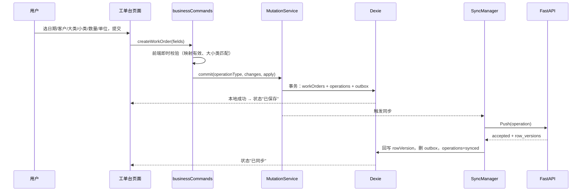
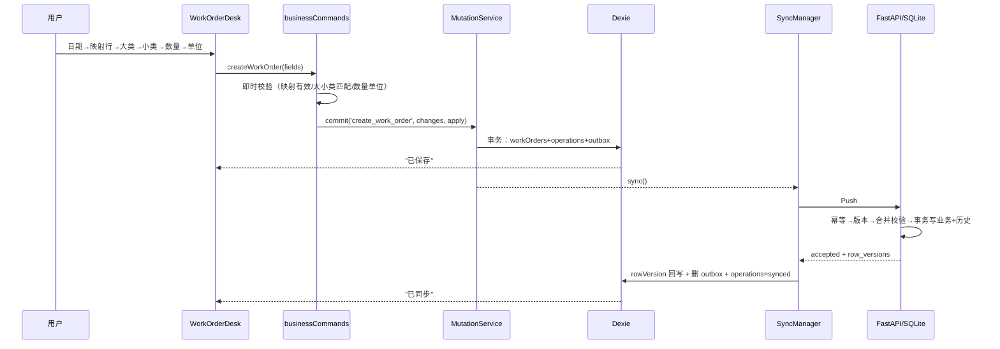
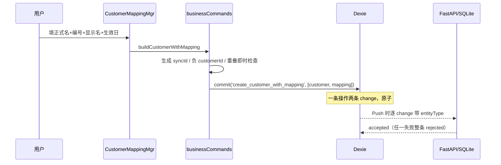

# 一期（P0/P1）业务功能实现设计

> 面向开发的实现设计。范围：把「每天记上账」的闭环立起来——服务选项维护、客户与编号映射维护、工单录入（P0），以及工单查询、汇总统计、同步状态展示（P1）。
> 相关文档：`docs/data-model.md`（数据结构）、`docs/sync-protocol.md`（同步协议）、`docs/error-codes.md`（错误码）、`docs/spec/agent-tools.md`（Agent 工具）。

## 1. 目的与范围

### 1.1 解决什么问题

数据模型与同步管线已经就绪，但还缺两层东西：

1. **业务语义缺口**：若干已定的业务规则没有落到校验代码里（小类可空、编号有效期重叠、小类结构校验、update 路径的跨表校验）。
2. **接口层缺口**：前端没有面向后续页面的 Repository 查询、业务命令和同步状态推导；Agent 工具注册表为空。

本设计补齐业务校验与前端接口层，使后续页面/调用方可以离线完成：维护服务选项与客户编号 → 录入工单 → 查询对账 → 看到每张单的同步状态；同时把只读查询与受控写草案接入 AI 助手（见 `docs/spec/agent-tools.md`）。**按用户最新要求：本期前端只做接口，不实施任何页面 UI。**

### 1.2 明确不做（本期边界）

- 工单编辑、软删、完成标记切换、批量定价（二期）。
- 历史记录与撤回 UI、冲突三方对比 UI（二期）。
- **全部前端页面 UI**：工单台 / 查账本 / 档案与设置 / AI 对话页等界面本期一律不做，只保留前端数据层与接口（用户 2026-08-15 明确要求）；页面交互方案仍为未定事项，见 `AGENTS.md`。
- 前端 AI 工具确认的可视化界面（同上：只留接口，见 `docs/spec/agent-tools.md` §8）。
- 定时后台同步（MVP 同步触发时机已定：提交后 / 前台恢复 / 网络恢复 / 手动）。
- 附件、图片、语音等大文件。

## 2. 核心原则（约束一切后续选择的不变量）

1. 所有写入仍走统一管线：`业务页面 → MutationService → Dexie（业务表 + operations + outbox）→ SyncManager → Push → BusinessCommandService → SQLite`。不新增第二条写入路径。
2. 业务语义校验两边都做：前端即时反馈，后端权威兜底；错误码以 `docs/error-codes.md` 为准。
3. 文本快照不变：改配置不改历史工单。
4. 一个动作一条操作；跨表动作（新建客户+首条编号、归档客户+收尾编号）是**一条操作、多个 change**，后端事务保证原子。
5. 离线新建的客户 `customer_id` 必须跨设备全局唯一（见 §5.5）。
6. 前端调用方只通过 Repository / 业务命令读写 Dexie，不直接碰 `db` 对象。

## 3. 现状盘点（基线）

已实现：

- 后端四张业务仓库（`apply_Write` 版本比对 / 软删 / row_version）、`BusinessCommandService`（幂等 → 跨表校验 → 原子事务 → 操作历史）、`/sync/push|pull|bootstrap` 三端点。
- 前端 Dexie 双库（meta + `db_<phone>`）、四业务表 Repository（只有 get/put/list 雏形）、`MutationService` 本地事务、`SyncManager`、`HttpSyncApi`、`AuthStore`、登录页。
- 后端 164 测试、前端 77 测试、`vue-tsc -b` 与 `vite build` 全绿。

已发现但未实现 / 未完成的缺口：

| 编号 | 缺口 | 影响 |
| --- | --- | --- |
| G1 | `work_orders.service_item` 在 SQL 与前端类型均为非空 | 无法表达「空大类先建、小类后补」 |
| G2 | 编号映射有效期重叠未校验（错误码已登记 `mapping_period_overlap`，无实现） | 两台设备离线建号可产生重叠映射 |
| G3 | `subcategories_json` 只校验「是数组+名字不重」，不校验每个小类的 `name/default_unit/is_active` 结构与默认单位非空 | 结构损坏的小类 JSON 能进库 |
| G4 | 跨表校验只作用于工单 create，且不看小类 `is_active` | 补小类、改日期/编号等 update 路径绕过权威校验 |
| G5 | 前端 `Customer` 无 `customerId`；离线新建客户无全局唯一 ID 方案 | 离线建客户后立刻录单会引用错误的 `customer_id` |
| G6 | outbox 一条操作的所有 change 共享同一个 `entityType` | 「新建客户一步建齐」等跨表原子操作无法 Push |
| G7 | Push accepted 后不把 `row_versions` 回写本地业务表 | 本地 `rowVersion` 停留在旧值，下一次编辑必然假冲突 |
| G8 | 前端 Repository 无查询/汇总接口、无业务命令层、无同步状态推导 | P0/P1 页面无数据入口 |
| G9 | Agent 工具注册表为空；ChatService 不支持确认握手 | AI 不能查账、不能生成写草案 |

## 4. 最小模型

把系统缩到最小：单设备、数据已经 bootstrap 成功、只做「录入一张工单」并看到「已保存 → 已同步」。



最小模型已经成立的前提是：本地有数据（bootstrap）、outbox 能表达这条操作（G6 修复）、`customer_id` 有效（G5 修复）、Push 后本地版本回写（G7 修复）。下面每个扩展都对应一个明确缺口。

## 5. 问题驱动的逐项扩展

> 扩展顺序是推理顺序，不是数据库迁移计划。实现直接按最终模型落地。

### 5.1 G1：工单小类可空、单价默认为空（录入语义对齐）

**问题**：业务上允许「先建空大类，小类后补」，也允许录单时暂不填单价。当前 `service_item NOT NULL` 让这两种情况都无法落库。

**机制**：

- 后端 `data/schema/business/04_work_orders.sql`：`service_item TEXT NOT NULL` → `service_item TEXT`（可空）。
- 后端 `WorkOrdersRepository._validate_fields`：`service_item` 为 `None` 时放行；非 `None` 且非 `str` 时返回新错误码 `invalid_service_item`。
- 前端 `db/schema/business/workOrders.ts`：`serviceItem: string | null`。
- `unit_price_cents` 保持可空：不传/传 `null` 即「尚未定价」，`0` 表示单价为零（语义已定，不改）。
- 录入页：小类不选时 `serviceItem=null`；选中后自动带出默认单位（可改）。

**对历史库的影响**：`apply_schema` 是 `CREATE TABLE IF NOT EXISTS`，不会改已存在的表。MVP 无生产数据，开发库直接删除重建即可；「已有库的列迁移」登记为后续事项（见 §8 边界）。

### 5.2 G3：小类 JSON 结构校验

**问题**：`subcategories_json` 里混入 `{"default_unit":"件"}` 这类缺 `name` 的坏数据时，`ServiceCategoriesRepository._validate_fields` 会放行，之后录入选择器解析就坏。

**机制**：`ServiceCategoriesRepository._validate_fields` 对 `subcategories_json`（JSON 字符串，wire 契约不变）逐项校验：

- 解析失败或非数组 → `invalid_subcategories`。
- 任一小类不是 `{name, default_unit, is_active}` 的合法对象（`name`/`default_unit` 非空字符串、`is_active` 为 bool、不允许额外必填缺失）→ `invalid_subcategories`。
- `name` 同数组内重复 → `subcategory_name_duplicate`（现有语义不变）。

错误码复用已登记的 `invalid_subcategories` / `subcategory_name_duplicate`，不新增。

### 5.3 G2：编号映射有效期重叠（后端权威兜底）

**问题**：同编号的两条映射如果有效期重叠，按日期选客户会出现二义；两台设备离线各建一条时前端各自都检查不到对方。

**机制**：重叠校验放在 `BusinessCommandService._validate_cross`（跨行查询，仓库单字段校验做不了）。对 `entity_type == "customer_code_mapping"` 的 create 与 update：

```text
候选区间 [new_valid_from, new_valid_to]
同账户、同 customer_code、不同 sync_id 的既有映射
重叠条件：existing.valid_from <= new_valid_to AND (existing.valid_to IS NULL OR existing.valid_to >= new_valid_from)
```

- 存在重叠 → rejected，错误码 `mapping_period_overlap`（`docs/error-codes.md` §4.2 已登记）。
- update 只改了 `valid_from` 时，用「旧记录字段 ∪ patch 字段」合并后的完整区间参与比较（见 §5.4 合并规则）。
- 区间端点含端点（`>=`/`<=`）：`001` 上半年止于 `2026-06-30`、下半年始于 `2026-07-01` 是合法衔接，不算重叠。

### 5.4 G4：update 路径的跨表校验（合并后校验）

**问题**：`_validate_cross` 现在 `base_version != 0` 直接返回 None。用户补小类、把工单日期改到无编号映射的日子、把编号改到无效编号时，后端权威校验全部旁路。

**机制**：把 `_validate_cross` 从「只校验 create」改为「对 patch 与现记录合并后的目标状态校验」：

1. `change.base_version == 0`：直接校验 `change.fields`。
2. `change.base_version > 0`：先读现记录，合并 `merged = {**existing, **fields}`；只对本次 patch 触及的规则做校验：
   - `service_category` 或 `service_item` 在 `fields` 中 → 校验大小类匹配 + 大类启用 + **小类启用**（补小类仍校验归属；新增小类 `is_active=false` 的检查）。
   - `work_order_date` 或 `customer_code` 在 `fields` 中 → 校验映射按新日期/编号有效。
   - `customer_id` 在 `fields` 中 → 客户存在且未归档。
3. 校验失败返回原有错误码（`service_item_mismatch` / `service_option_disabled` / `customer_mapping_invalid` / `customer_not_found`），并修正 §5.3 的映射重叠校验同样支持 update。
4. 工单 `service_item=null`（空小类）合法：仅当 `service_item` 非空时才做大小类校验。

### 5.5 G5：离线新建客户的 `customer_id`

**问题**：后端 `customers.customer_id` 是自增主键，但离线客户端必须立刻给新客户一个 `customer_id`，否则同一次操作里的编号映射、后续工单都无法引用它；两台设备各自自增必然撞号。

**机制**（最小可行方案，不新增表）：

- 前端新建客户时生成 `customerId = -(int(sync_id 去掉 "sync-" 前缀的 12 位十六进制, 16))`。同一 `sync_id` 唯一 → 负 ID 跨设备唯一；负值不占用后端自增序列。
- 后端 `customers` 表允许显式插入负整数主键（SQLite 合法）；`BusinessRepository` create 原样写入 `fields.customer_id`。后端不再为客户端新建分配 `customer_id` 的映射表——负 ID 就是权威 ID，永久稳定。
- 前端 `Customer` 类型补 `customerId: number`；bootstrap / Pull 的 snake→camel 转换自然带上 `customerId`。
- `CustomerCodeMappings` 与 `WorkOrders` 的 `customerId` 引用同一个值。

### 5.6 G6：outbox 支持跨实体原子操作

**问题**：`SyncManager.toPushOperation` 用 `entityTypeFor(operationType)` 给整条操作所有 change 定 entity_type，无法表达「新建客户一步建齐（customer + customer_code_mapping）」与「归档客户自动收尾编号（customer + 多条 customer_code_mapping）」这类一条操作多实体。

**机制**：

- `OutboxCommandChange` 增加可选 `entityType` 字段；`toPushOperation` 对每条 change 用 `c.entityType ?? entityTypeFor(operationType)`。
- 新操作类型（命名固定，wire 与 `operations.operationType` 一致）：
  - `create_work_order` / `update_work_order`
  - `create_customer_with_mapping`（change 1: `entity_type=customer`，change 2: `entity_type=customer_code_mapping`，顺序固定，客户在前）
  - `update_customer`（只改正式名）
  - `archive_customer_with_mappings`（change 1: customer `archived_at`；后续 change: 该客户每条 `valid_to IS NULL` 的映射 `valid_to=归档日`）
  - `create_customer_code_mapping` / `update_customer_code_mapping`
  - `create_service_category` / `update_service_category`
- `entityTypeFor` 仅作为无 `entityType` 字段时的回退；含回退逻辑时 `create_customer_with_mapping` / `archive_customer_with_mappings` 判空直接抛错（这些类型必须逐 change 标注）。
- 本地 `apply` 必须严格按 change 顺序修改对应表（客户在前，映射在后）。

### 5.7 G7：Push accepted 回写本地 `rowVersion`

**问题**：本地记录创建时 `rowVersion=1`，Push accepted 后服务端可能是 3；`applyPushResults` 只删 outbox 改 operations，业务表版本不更新，下一次编辑的 `baseVersion` 还是 1 → 假冲突。

**机制**：`applyPushResults` 的 accepted 分支在**同一 Dexie 事务**中：

1. 按 `result.row_versions` 逐 `syncId` 更新对应业务表记录的 `rowVersion`（用 `result` 中的新版本，直接覆盖本地值）。
2. 其余逻辑不变（删 outbox、operations 标 synced）。
3. 事务表列表补上四张业务表。

### 5.8 G8：前端 Repository 查询与业务命令

#### 5.8.1 Repository 查询接口

前端每账户独立库天然只含当前账户数据，不需要按账户过滤。以下方法全部返回 promise，排序固定：

`WorkOrdersRepository`：

```ts
export interface WorkOrderFilter {
  dateFrom?: string | null       // YYYY-MM-DD，含端点
  dateTo?: string | null
  customerCode?: string | null   // 精确
  customerName?: string | null   // 包含匹配
  serviceCategory?: string | null
  serviceItem?: string | null    // null 表示"小类为空"
  isCompleted?: boolean | null
  unpricedOnly?: boolean         // unitPriceCents === null
  keyword?: string | null        // 匹配编号/客户名/大类/小类任一包含
  limit?: number
  offset?: number
}

async query(filters?: WorkOrderFilter): Promise<WorkOrder[]>
// 排除 deletedAt !== null；按 workOrderDate DESC、createdAt DESC 排序；limit/offset 分页

async summarize(filters?: Omit<WorkOrderFilter, 'limit'|'offset'>): Promise<WorkOrderSummary>
// WorkOrderSummary = { count, totalQuantity, totalAmountCents, unpricedCount }
// totalAmountCents 只累加 unitPriceCents !== null 的 quantity * unitPriceCents（整数分）
```

`CustomersRepository`：

```ts
async list(includeArchived = false): Promise<Customer[]>  // canonicalName 升序
async getByCustomerId(customerId: number): Promise<Customer | undefined>
```

`CustomerCodeMappingsRepository`：

```ts
async list(filters?: {
  customerCode?: string | null
  onDate?: string | null       // 仅返回该日期有效（validFrom <= d <= validTo）
  customerId?: number | null
}): Promise<CustomerCodeMapping[]>  // customerCode 升序、validFrom 升序
async findValid(customerCode: string, date: string): Promise<CustomerCodeMapping | undefined>
```

`ServiceCategoriesRepository`：

```ts
async list(includeInactive = false): Promise<ServiceCategory[]>  // categoryName 升序
async findByCategoryName(name: string): Promise<ServiceCategory | undefined>
```

#### 5.8.2 业务命令层 `services/businessCommands.ts`

纯函数 + 一个使用 `MutationService` 的提交入口。校验错误用 `BusinessRuleError(errorCode)` 抛出，页面只展示错误码。

```ts
export type WorkOrderFields = {
  workOrderDate: string
  customerId: number
  customerCode: string
  customerName: string
  serviceCategory: string
  serviceItem: string | null
  quantity: number
  unit: string
  unitPriceCents: number | null
}

export function validateWorkOrderInput(fields, db)      // 前端即时校验
export function buildCreateWorkOrderChange(fields)      // baseVersion 0 + patch + baseSnapshot
export async function createWorkOrder(db, fields)        // validate → MutationService.commit
export async function buildCustomerWithMapping(db, input) // 生成 syncId / 负 customerId / 快照 / 重叠即时检查
export async function archiveCustomerWithMappings(db, customerSyncId)
export async function createServiceCategory(db, {categoryName, subcategories})
export async function updateServiceCategory(db, syncId, patch)
// ……映射维护同理
```

前端即时校验规则（与后端一致，错误码同 `docs/error-codes.md`）：

- 工单：数量正整数（`invalid_quantity`）、单位非空（`invalid_unit`）、单价 `null` 或 ≥0（`invalid_unit_price`）、映射按业务日期有效（`customer_mapping_invalid`）、大小类匹配且未停用（`service_item_mismatch` / `service_option_disabled`）。
- 映射：`valid_to >= valid_from`（`invalid_mapping_period`）、同编号区间不重叠（`mapping_period_overlap`）、客户存在（`customer_not_found`）。
- 服务选项：大类名同账户不重复（`category_name_duplicate`）、小类结构与重名（`invalid_subcategories` / `subcategory_name_duplicate`）。

#### 5.8.3 同步状态推导 `services/syncStatus.ts`

```ts
export type RecordSyncStatus = 'saved' | 'synced' | 'conflict' | 'rejected'
export async function getRecordSyncStatus(db, syncId): Promise<RecordSyncStatus>
export async function getSyncCounts(db): Promise<{ pending: number; conflict: number; rejected: number }>
```

推导规则：

1. outbox 中存在该 `syncId` 的 `conflict` → `conflict`；`rejected` → `rejected`。
2. outbox 中存在该 `syncId` 的 `pending`/`sending` → `saved`（已保存到本机）。
3. 否则 → `synced`。

### 5.9 G9：AI 工具与确认握手

见 `docs/spec/agent-tools.md`。本设计只约定：Agent 的读工具查后端权威数据（不是前端 Dexie），写工具只生成草案、经用户确认后走与页面完全相同的 outbox → Push 管线。

## 6. 最终模型（文件与改动清单）

### 6.1 后端

| 文件 | 改动 |
| --- | --- |
| `data/schema/business/04_work_orders.sql` | `service_item` 改可空 |
| `repositories/work_orders.py` | `service_item` 校验（null 放行 / 非 str 报 `invalid_service_item`） |
| `repositories/service_categories.py` | 小类结构校验 |
| `services/business_command.py` | 合并后跨表校验（update 生效）、映射重叠、小类停用检查 |
| `repositories/*_business.py`（查询方法） | `query_Orders` / `summarize_Orders` / `list_Customers` / `list_Mappings` / `list_Categories`（供 Agent 工具与诊断复用） |
| `services/business_query.py` | `BusinessQueryService`：编排四个仓库的只读查询，统一 limit/返回结构 |
| `errors.py` / `docs/error-codes.md` | 新增 `invalid_service_item`；确认 `mapping_period_overlap` 已登记 |

### 6.2 前端

| 文件 | 改动 |
| --- | --- |
| `db/schema/business/workOrders.ts` | `serviceItem: string \| null` |
| `db/schema/business/customers.ts` | 补 `customerId: number` |
| `db/schema/operations/outbox.ts` | `OutboxCommandChange` 补可选 `entityType` |
| `repositories/workOrders.ts` | `query` / `summarize` |
| `repositories/customers.ts` | `list` / `getByCustomerId` |
| `repositories/customerCodeMappings.ts` | `list` / `findValid` |
| `repositories/serviceCategories.ts` | `list` / `findByCategoryName` |
| `services/businessCommands.ts`（新） | 校验 + 命令构建 + 提交 |
| `services/syncStatus.ts`（新） | 单记录状态推导 + 计数 |
| `services/syncManager.ts` | `toPushOperation` 逐 change entityType；accepted 回写 rowVersion |
| `services/errorMessages.ts`（新） | `error_code → 中文文案` 映射（`docs/error-codes.md` §5） |

### 6.3 页面（P0/P1）——本期不实施，仅存档

> 按用户最新要求（2026-08-15），本期不实施任何前端页面 UI；页面交互方案仍为未定事项（见 `AGENTS.md`）。下面内容仅存档推导结果，后续实施前需重新确认。

曾推导的页面形态（存档）：

```text
App.vue
├── components/navigation/AppTabBar.vue      # 工单台 / 查账本 / AI助手 / 档案与设置
├── components/common/StatusBadge.vue        # 已保存 / 已同步 / 冲突
└── views/
    ├── WorkOrderDesk.vue                    # 日期、常用客户行、大类-小类药丸、数量/单价、单位自动带出、提交、今日流水
    ├── LedgerView.vue                       # 日期大胶囊 + 客户/品类速选 + 汇总条 + 工单卡片列表（含状态徽标）
    ├── AiChatView.vue                       # 会话列表/创建、消息流、SSE 打字机、快捷指令胶囊、确认接口桩
    └── SettingsView.vue                     # 分组设置：客户与编号映射 / 服务大类小类 / 同步状态 / 账户与登出
        ├── CustomerMappingMgr.vue           # 新建客户一步建齐、加编号、改编号、归档（自动收尾）
        ├── ServiceCategoryMgr.vue           # 新增大类、增改小类、停用启用
        └── SyncStatusPanel.vue              # pending/conflict/rejected 计数、最近同步时间、手动同步
```

视觉规范：黑白灰极简、`#F9FAFB` 背景、`#111827` 主文字、`#2563EB` 焦点、`tabular-nums` 数字、触控高度 ≥ 48px（token 落到 `style.css` 全局变量）。

页面行为验收点：

- **工单台**：日期默认今天；客户从「按日期有效的映射」中选（点映射行整行快照）；大类选中小类铺开；选小类自动带单位（可改）；单价可空；提交 → 立即插入今日流水，徽标「已保存」，同步完成变「已同步」。
- **查账本**：日期胶囊（今天/昨天/本周/本月/自选区间）；客户速选取最近录入的前 8 个客户；汇总条 `共 N 笔 · M 件 · 合计 ¥X.XX`，未定价单单独显示笔数不计金额；卡片点击本期只展示只读摘要（编辑是二期）。
- **档案与设置**：客户维护按 §5.6 的操作类型提交；服务选项维护即时校验；同步面板显示计数与手动同步按钮。
- **AI 助手**：见 `docs/spec/agent-tools.md` §8。

## 7. 完整调用流程

### 7.1 录入工单（P0 主链路）



### 7.2 新建客户一步建齐（跨实体原子）



## 8. 边界（吸引人但有意不做）

- 已有 SQLite 开发库的列级迁移：删除 `backend/data/` 下的库文件重建；迁移框架等真实数据出现再设计。
- 二期全部交互（编辑 / 软删 / 完成标记 / 撤回 UI / 冲突 UI）。
- 在线直连的业务 CRUD REST 端点：业务写入仍只有 `/sync/push` 一条权威入口（Agent 读工具除外）。
- 查询的分页游标与虚拟滚动：MVP 前端本地数据量小，`limit/offset` 足够。

## 9. 测试策略

沿用 pytest + `tmp_path`（后端）与 vitest + fake-indexeddb（前端），只测公共接口：

- 后端：工单 `service_item` null/非法、小类结构、映射重叠（create 与 update 合并路径）、update 跨表校验、`invalid_service_item` 错误码。
- 前端：Repository `query`/`summarize` 的排序、过滤、软删排除与金额计算；businessCommands 的即时校验与多实体 change 形状；`toPushOperation` 逐 change entityType；accepted 回写 rowVersion；`syncStatus` 推导。
- 页面组件：本期不实施页面，故无组件测试；接口层以 `vue-tsc -b` + `vite build` + 服务单测为准。

## 10. 验收标准

1. `backend`: `pytest -m "not live"` 全绿；新测试覆盖 §9 后端条目。
2. `frontend`: `npm run test` 全绿；`npm run build`（`vue-tsc -b`）零错误。
3. 手动冒烟（后端+接口层，不涉及页面 UI）：登录 → 用接口层命令建档客户+编号 → 维护服务选项 → 录一张工单（小类可空、单价可空）→ Repository 查询/汇总正确 → 状态从「已保存」变「已同步」→ Agent 读工具能查账、写草案事件出现且不落库。
4. 文档同步：`docs/data-model.md`（service_item 可空、负 customer_id、outbox entityType）、`docs/error-codes.md`（invalid_service_item）、`AGENTS.md`（未定事项与当前状态）。
